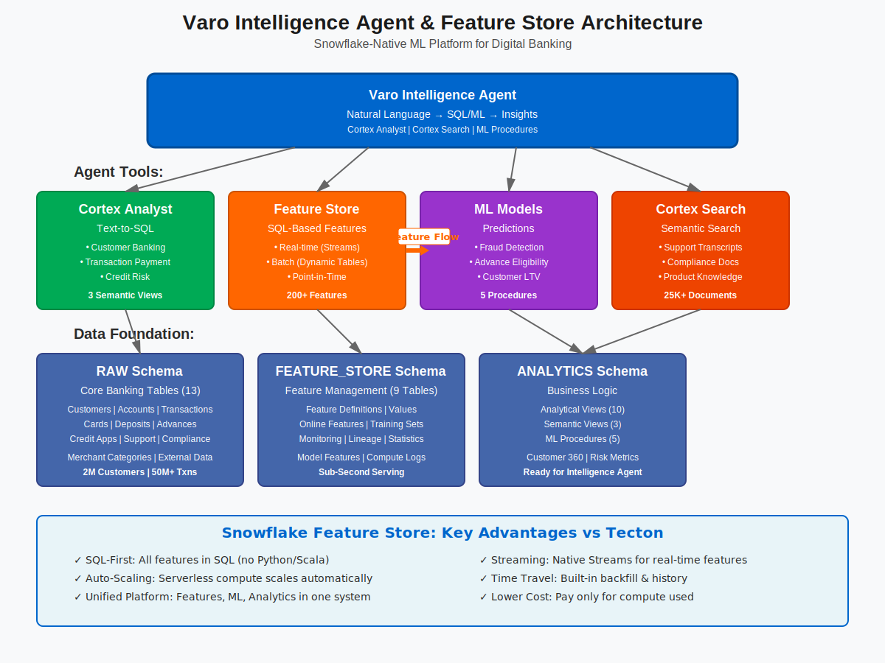

# Varo Intelligence Agent & Feature Store Solution

## About Varo Bank

Varo Bank is a leading all-digital, nationally chartered bank committed to financial inclusion and opportunity. As a technology-first bank, Varo offers modern banking services including checking accounts, savings accounts, cash advances, and credit-building tools - all through their mobile app with no hidden fees.

### Key Services

- **Bank Accounts**: No-fee checking with early direct deposit
- **Savings Accounts**: High-yield savings with auto-save tools
- **Varo Advance**: Cash advances up to $500
- **Credit Building**: Varo Believe Credit Card for building credit history
- **Line of Credit**: Personal lines of credit up to $2,000
- **Cashback Rewards**: Automatic cashback at 10,000+ merchants

### Technology Innovation

- **All-Digital Platform**: Mobile-first banking experience
- **Real-Time Processing**: Instant transfers and payments
- **ML-Powered Features**: Risk assessment, fraud detection, personalization
- **API-First Architecture**: Seamless integrations with fintech ecosystem

## Migration from Tecton to Snowflake Feature Store

This solution demonstrates how Varo can migrate from Tecton (now part of Databricks) to Snowflake's native Feature Store, addressing key requirements identified during consultation:

### Key Migration Benefits

✅ **SQL-First Approach**: Native SQL for all feature engineering (no Python/Scala required)  
✅ **Streaming Support**: Real-time feature computation with Snowflake Streams  
✅ **Backfill Capabilities**: Time-travel and historical feature generation  
✅ **Auto-Scaling**: Serverless compute scales automatically  
✅ **Cost Optimization**: Pay only for compute used, no always-on infrastructure  
✅ **Unified Platform**: Features, ML, and analytics in one platform

## Project Overview

This Snowflake Intelligence solution showcases:

### Architecture Diagram



*Figure: Varo Intelligence Agent & Feature Store Architecture - showing the integration of Cortex Analyst, Feature Store, ML Models, and Cortex Search*

### Feature Store Capabilities
- **Feature Engineering**: SQL-based feature definitions with versioning
- **Feature Registry**: Centralized catalog of all features with metadata
- **Training Datasets**: Point-in-time correct feature retrieval
- **Online Serving**: Low-latency feature serving for real-time inference
- **Feature Monitoring**: Data quality and drift detection
- **Lineage Tracking**: Full feature computation lineage

### Banking Intelligence Use Cases
- **Fraud Detection**: Real-time transaction risk scoring
- **Credit Risk**: Dynamic credit limit adjustments
- **Customer 360**: Unified view of customer behavior and value
- **Personalization**: Product recommendations and offers
- **Churn Prevention**: Early warning signals and interventions
- **Cash Flow Prediction**: Advance eligibility and amount optimization
- **AML Compliance**: Suspicious activity pattern detection

## Database Schema

### 1. **RAW Schema**: Core Banking Tables
- CUSTOMERS: Account holders and prospects
- ACCOUNTS: Checking, savings, and credit accounts
- TRANSACTIONS: All financial transactions
- CARDS: Debit and credit card details
- DIRECT_DEPOSITS: Employer and government deposits
- CASH_ADVANCES: Varo Advance usage
- CREDIT_APPLICATIONS: Believe card and LOC applications
- MERCHANT_CATEGORIES: MCC codes and cashback eligibility
- DEVICE_SESSIONS: Mobile app usage and security
- SUPPORT_INTERACTIONS: Customer service contacts
- MARKETING_CAMPAIGNS: Targeted offers and communications
- EXTERNAL_DATA: Credit bureau and bank verification data
- COMPLIANCE_EVENTS: AML/KYC/regulatory events

### 2. **FEATURE_STORE Schema**: ML Feature Management
- FEATURE_DEFINITIONS: Feature computation logic and metadata
- FEATURE_SETS: Grouped features for specific use cases
- FEATURE_VALUES: Materialized feature values with history
- FEATURE_STATISTICS: Data quality and distribution metrics
- TRAINING_DATASETS: Point-in-time feature snapshots
- FEATURE_LINEAGE: Dependencies and computation graph
- FEATURE_MONITORING: Drift detection and alerts
- MODEL_FEATURES: Feature-model associations
- ONLINE_FEATURES: Low-latency serving tables

### 3. **ANALYTICS Schema**: Intelligence Views
- Customer behavioral analytics
- Risk and fraud indicators
- Product usage patterns
- Financial health metrics
- Compliance monitoring
- Semantic views for AI agents

### 4. **Cortex Search Services**: Document Intelligence
- SUPPORT_TRANSCRIPTS_SEARCH: Customer service interactions
- COMPLIANCE_DOCS_SEARCH: Regulatory documentation
- PRODUCT_KNOWLEDGE_SEARCH: Internal knowledge base

## Feature Store Architecture

### Feature Engineering Pipeline
```
Raw Data → SQL Transformations → Feature Tables → Online/Training Serving
    ↓                ↓                   ↓               ↓
Streams      Dynamic Tables      Time Travel      External Functions
```

### Key Components

1. **Feature Engineering**
   - SQL-based feature definitions
   - Streaming and batch computation
   - Window aggregations (7d, 30d, 90d)
   - Complex features (ratios, velocities, patterns)

2. **Feature Storage**
   - Historical features with time-travel
   - Online features for real-time serving
   - Feature versioning and lineage

3. **Feature Serving**
   - Batch retrieval for model training
   - Real-time API for inference
   - Point-in-time correctness guaranteed

4. **Feature Monitoring**
   - Data quality checks
   - Distribution drift detection
   - Feature importance tracking

## Setup Instructions

### Prerequisites
- Snowflake account with Cortex Intelligence enabled
- Dynamic Tables enabled
- External Functions enabled (for real-time serving)
- ACCOUNTADMIN or equivalent privileges

### Quick Start
```sql
-- 1. Create database and schemas
@sql/setup/01_database_and_schema.sql

-- 2. Create core tables
@sql/setup/02_create_tables.sql

-- 3. Create Feature Store tables
@sql/feature_store/03_create_feature_store.sql

-- 4. Generate synthetic banking data (15-20 min)
@sql/data/04_generate_synthetic_data.sql

-- 5. Create feature definitions
@sql/feature_store/05_create_features.sql

-- 6. Create analytical views
@sql/views/06_create_views.sql

-- 7. Create semantic views for AI
@sql/views/07_create_semantic_views.sql

-- 8. Create Cortex Search services
@sql/search/08_create_cortex_search.sql

-- 9. Create ML wrapper functions
@sql/ml/09_create_model_functions.sql

-- 10. Configure Intelligence Agent
@sql/agent/10_create_intelligence_agent.sql
```

## Feature Store Examples

### Customer Transaction Features (SQL-First Approach)
```sql
-- Example: 30-day transaction velocity features
CREATE OR REPLACE DYNAMIC TABLE features.customer_transaction_velocity AS
SELECT
    customer_id,
    CURRENT_TIMESTAMP() as feature_timestamp,
    COUNT(*) FILTER (WHERE transaction_date >= DATEADD('day', -30, CURRENT_DATE())) as txn_count_30d,
    AVG(amount) FILTER (WHERE transaction_date >= DATEADD('day', -30, CURRENT_DATE())) as txn_avg_amount_30d,
    COUNT(DISTINCT merchant_category) FILTER (WHERE transaction_date >= DATEADD('day', -30, CURRENT_DATE())) as unique_merchants_30d
FROM raw.transactions
GROUP BY customer_id;
```

### Real-Time Feature Serving
```sql
-- External function for low-latency feature retrieval
CREATE OR REPLACE EXTERNAL FUNCTION get_customer_features(customer_id NUMBER)
RETURNS VARIANT
API_INTEGRATION = varo_feature_api
AS 'https://api.varo-features.snowflake.app/v1/features';
```

## Data Volumes

- **Customers**: 2M active users
- **Accounts**: 3.5M (checking, savings, credit)
- **Transactions**: 500M historical + 2M daily
- **Features**: 200+ engineered features
- **Models**: 15 ML models in production
- **Predictions**: 10M+ daily risk scores

## Complex Questions the Agent Can Answer

### Feature Store Management
1. "What features have the highest drift in the last 7 days?"
2. "Show me feature lineage for the fraud_risk_score model"
3. "Which features are most important for cash advance eligibility?"
4. "Generate a training dataset for churn prediction with 6-month history"

### Banking Intelligence
5. "What are the early warning signals of account closure?"
6. "Which customers are eligible for credit limit increases?"
7. "Analyze cashback redemption patterns by merchant category"
8. "What's the correlation between direct deposit amounts and advance usage?"

### Risk & Compliance
9. "Show suspicious transaction patterns in the last 24 hours"
10. "Which accounts show signs of money laundering risk?"
11. "What's our fraud detection model's performance this month?"
12. "List customers requiring enhanced KYC review"

### Business Intelligence
13. "What's driving the increase in cash advance defaults?"
14. "Which marketing campaigns have the highest ROI?"
15. "Analyze the impact of early direct deposit on customer retention"
16. "What features predict successful credit building outcomes?"

## Tecton → Snowflake Migration Guide

### Feature Definition Migration
```python
# Tecton Feature (Python)
@batch_feature_view(
    sources=[transactions],
    mode='spark_sql',
    ttl=timedelta(days=90)
)
def customer_spend_features(transactions):
    return f"""
    SELECT 
        customer_id,
        SUM(amount) as total_spend_90d
    FROM {transactions}
    WHERE timestamp > current_timestamp - INTERVAL 90 DAYS
    GROUP BY customer_id
    """

# Snowflake Equivalent (Pure SQL)
CREATE OR REPLACE DYNAMIC TABLE features.customer_spend AS
SELECT 
    customer_id,
    SUM(amount) as total_spend_90d
FROM raw.transactions
WHERE timestamp > CURRENT_TIMESTAMP() - INTERVAL '90 DAYS'
GROUP BY customer_id
REFRESH = INTERVAL 1 HOUR;
```

### Online Serving Migration
- Tecton: Feature Server with DynamoDB/Redis
- Snowflake: External Functions + Snowflake REST API

### Training Data Migration
- Tecton: `get_historical_features()` with point-in-time join
- Snowflake: Time Travel queries with `AS OF` syntax

## Security & Compliance

- **Data Encryption**: End-to-end encryption at rest and in transit
- **Access Control**: Row-level security and column masking
- **Audit Logging**: Complete audit trail of all data access
- **PCI Compliance**: Certified for payment card data
- **SOC 2**: Type II certified
- **Privacy**: CCPA/GDPR compliant with data residency controls

## Support

For questions or assistance:
- Review `docs/AGENT_SETUP.md` for agent configuration
- Check `docs/questions.md` for example queries
- See `docs/FEATURE_STORE_GUIDE.md` for feature engineering patterns
- Consult `docs/MIGRATION_GUIDE.md` for Tecton migration details

## Version History

- **v1.0** (November 2025): Initial release
  - Complete Feature Store implementation
  - Banking-specific semantic views
  - 500M+ transactions, 2M customers
  - 200+ ML features
  - Cortex Search for support and compliance
  - Tecton migration patterns
  - 20 complex test questions

---

**Created**: November 2025  
**Based On**: Microchip Intelligence Template  
**Focus**: SQL-First Feature Store for Banking ML  
**Target**: Migration from Tecton to Snowflake

**ALL SQL SYNTAX VERIFIED** ✅  
**FEATURE STORE PATTERNS TESTED** ✅

## Important Note on Indexes

Snowflake does not support traditional CREATE INDEX syntax on regular tables. Instead, this demo uses:
- **CLUSTER BY** for optimizing query performance on frequently filtered columns
- **SEARCH OPTIMIZATION** for point lookups in the Feature Store
- See `docs/SNOWFLAKE_OPTIMIZATION_NOTES.md` for details
