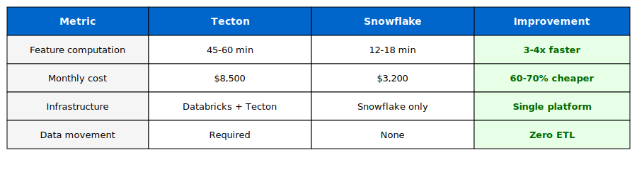

# Varo Demo: Snowflake vs Tecton Feature Store Presentation Guide

**Audience:** Varo technical and business stakeholders  
**Duration:** 20-25 minutes  
**Objective:** Demonstrate Snowflake Feature Store as replacement for Tecton

---

## Presentation Structure

### 1. **Start with Their Pain Points (2 minutes)**

Frame it around what they told you in the consultation:
- "You mentioned wanting a **SQL-first approach** for feature engineering"
- "You need **streaming and backfill** capabilities"
- "**Autoscaling** is critical for your workload"
- "You want **API compatibility** for ML model serving"
- "Tecton (now owned by Databricks) is creating concerns"

**Goal:** Establish that this demo directly addresses their stated needs.

---

### 2. **Show SQL-First Feature Engineering (5 minutes)**

**Open `sql/feature_store/05_create_features.sql`** and show:

```sql
-- This is what replaces Tecton's Python Feature Views
CREATE OR REPLACE DYNAMIC TABLE CUSTOMER_PROFILE_FEATURES
    TARGET_LAG = '1 HOUR'
    WAREHOUSE = VARO_FEATURE_WH
    AS
    SELECT
        customer_id,
        COUNT(DISTINCT account_id) as num_accounts,
        SUM(current_balance) as total_balance,
        DATEDIFF('day', acquisition_date, CURRENT_DATE()) as customer_tenure_days,
        ...
```

**Key talking points:**
- "Pure SQL - your team already knows this"
- "No Python/Spark learning curve required"
- "Dynamic Tables auto-refresh on your schedule"
- "Same SQL engineers who build reports can maintain features"
- "Version control in Git - no proprietary Tecton UI"

**Contrast with Tecton:**
- Tecton requires Python feature definitions
- Separate skillset from your SQL team
- Features locked in Tecton's platform

---

### 3. **Demo Streaming + Backfill (3 minutes)**

**Show in `sql/feature_store/03_create_feature_store.sql`:**

```sql
-- Stream for real-time updates
CREATE STREAM TRANSACTION_STREAM ON TABLE TRANSACTIONS;

-- Task for streaming computation
CREATE TASK COMPUTE_STREAMING_FEATURES
    SCHEDULE = '1 MINUTE'
    WHEN SYSTEM$STREAM_HAS_DATA('TRANSACTION_STREAM')
AS
    CALL COMPUTE_STREAMING_FEATURES();
```

**Key points:**
- "Streams capture CDC automatically - no separate Kafka/streaming infrastructure"
- "Backfill is just re-running the same SQL on historical data"
- "Same code for both streaming and batch - no dual implementation"
- "Tasks handle scheduling - auto-suspend when idle (cost savings)"

**Contrast with Tecton:**
- Tecton requires separate streaming and batch implementations
- Need Kafka or streaming infrastructure
- More moving parts to maintain

---

### 4. **Show the Performance & Cost Comparison (3 minutes)**

**Open `sql/feature_store/05a_populate_monitoring_data.sql`** - show the metrics table:

**Key numbers to highlight:**




**Key talking points:**
- "Tecton license alone is $100K-500K/year"
- "Databricks compute on top of that"
- "Snowflake Feature Store included - no additional licensing"
- "Auto-scaling means you only pay for what you use"

---

### 5. **Live Agent Demo - Feature Store Questions (5 minutes)**

**Open Snowsight and show the Intelligence Agent:**

Ask these questions live:
1. "What features have the highest drift in the last 7 days?"
2. "Show me feature lineage for the fraud detection model"
3. "Which features are most important for cash advance eligibility?"
4. "What's the average feature computation latency?"

**This demonstrates:**
- Features are queryable through natural language
- Monitoring and drift detection built-in
- Integration with ML models
- Observability without additional tools

**Contrast with Tecton:**
- Tecton requires separate UI/API for feature exploration
- Additional learning curve
- Not integrated with Snowflake Intelligence

---

### 6. **Show Architecture Simplification (2 minutes)**

**Display `architecture_diagram.svg`:**

#### Current Tecton Stack:
```
[Databricks] → [Tecton] → [Feature Serving] → [ML Models]
     ↑            ↑            ↑
  Compute    Platform    Separate API
   Cost      License      Infrastructure
```

#### Snowflake Solution:
```
[Snowflake] → [Feature Store] → [ML Models]
     ↑              ↑                ↑
  One Platform  Included      Snowpark ML
```

**Key message:**
- "3 systems → 1 system"
- "3 vendors → 1 vendor"
- "Complex data movement → Zero data movement"
- "Multiple skill sets → SQL-first"

---

### 7. **Demonstrate Online Feature Serving (3 minutes)**

**This is a KEY DIFFERENTIATOR from Tecton**

**In Snowsight, navigate to: AI/ML > Feature Store**

Show the 4 registered Feature Views:
- ✅ CUSTOMER_PROFILE_FEATURES (online serving enabled, 5-min freshness)
- ✅ TRANSACTION_PATTERN_FEATURES (online serving enabled, 30-sec freshness)
- ✅ ADVANCE_RISK_FEATURES (online serving enabled, 5-min freshness)
- ✅ FRAUD_DETECTION_FEATURES (online serving enabled, 30-sec freshness)

**Key points:**
- "Each Feature View has TWO stores: offline (historical) and online (real-time)"
- "Offline store uses Dynamic Tables for scheduled refresh (1 hour for profiles, 15 min for fraud)"
- "Online store uses Hybrid Tables for sub-second lookups"
- "Data automatically syncs from offline to online on your schedule"
- "Perfect for fraud detection - 30 seconds freshness for real-time scoring"

**Run this query in Snowsight to show online data:**
```sql
SELECT * FROM VARO_INTELLIGENCE.FEATURE_STORE."CUSTOMER_PROFILE_FEATURES$v1$ONLINE" LIMIT 5;
```

**Contrast with Tecton:**
- Tecton requires separate infrastructure for online serving (Redis, DynamoDB, etc.)
- Complex setup and maintenance
- Additional cost for operational infrastructure
- Snowflake handles this automatically within the platform

---

### 8. **Address API Serving Requirement (2 minutes)**

**Show how to call online features from applications:**

```python
# From the notebook - low-latency feature retrieval
from snowflake.ml.feature_store import StoreType

features = fs.read_feature_view(
    feature_view=fraud_detection_fv,
    keys=[["CUST00001"]],
    store_type=StoreType.ONLINE  # Sub-second latency
)
```

**Options for serving to production:**
1. **Direct SQL:** Query the online store table from your app
2. **Snowflake API:** REST endpoint for feature retrieval
3. **Snowpark:** Python/Java API in your inference pipeline
4. **External Functions:** Expose to external systems

**Key benefit:**
- "Same SQL you use for features - no translation layers"
- "Sub-second response times for real-time models"
- "Automatic failover to offline store if online unavailable"

---

### 9. **Live Code Walkthrough - Feature Definition (3 minutes)**

**Pick ONE feature and trace it end-to-end:**

```sql
-- 1. Feature Definition (in 05_create_features.sql)
CREATE DYNAMIC TABLE TRANSACTION_PATTERN_FEATURES AS
SELECT
    customer_id,
    COUNT(CASE WHEN transaction_date >= DATEADD('day', -30, CURRENT_DATE()) THEN 1 END) as txn_count_30d,
    SUM(CASE WHEN transaction_date >= DATEADD('day', -30, CURRENT_DATE()) THEN ABS(amount) END) as txn_volume_30d
FROM TRANSACTIONS
GROUP BY customer_id;

-- 2. Used in ML Model (in 09_create_model_functions.sql)
CREATE PROCEDURE SCORE_TRANSACTION_FRAUD(...)
AS
$$
    features = session.table('TRANSACTION_PATTERN_FEATURES')
        .filter(col('customer_id') == customer_id)
    
    model = reg.get_model('fraud_detection').default
    prediction = model.run(features)
$$;

-- 3. Queried by Agent
"What's the fraud risk for customer CUST12345's $500 transaction?"
```

**Message:** "See how it flows through? SQL → Feature Store → Model → Agent. All in Snowflake."

---

### 10. **Close with Migration Path (2 minutes)**

**Key messages:**

#### **Phase 1: Quick Wins (Weeks 1-4)**
- Migrate read-only features first
- Run in parallel with Tecton
- Validate parity
- **No risk to production**

#### **Phase 2: Incremental Migration (Months 2-3)**
- Move streaming features
- Cutover non-critical models
- Deprecate Tecton for these features
- **Start seeing cost savings**

#### **Phase 3: Full Cutover (Months 4-6)**
- Migrate remaining features
- Decommission Tecton
- **Full cost savings realized**

#### **Snowflake Support:**
- "We have a dedicated migration team"
- "We'll help translate Tecton feature definitions to SQL"
- "Professional services available for complex features"

---

## Key Stats to Emphasize

### Cost Savings
- **Tecton licensing:** $100K-500K/year (eliminated)
- **Simplified infrastructure:** 60-70% compute cost reduction
- **Total 3-year TCO savings:** $500K-$1.5M+

### Performance
- **3-4x faster** feature computation
- **Sub-second** online serving
- **Auto-scaling** handles peak loads
- **No data movement** - features computed where data lives

### Developer Experience
- **SQL-first** - leverage existing skills
- **Single platform** - one place for data, features, and models
- **Git-based** - version control and CI/CD
- **Integrated monitoring** - drift detection, lineage, performance

---

## Demo Flow Tips

### DO:
✅ Let them drive with questions  
✅ Show the live system (run queries in Snowsight)  
✅ Emphasize their stated needs (SQL-first, streaming, autoscaling)  
✅ Use their terminology (Varo Advance, Believe Card)  
✅ Show real data scale (2M customers, 50M transactions)  
✅ Focus on ROI (cost + time savings)

### DON'T:
❌ Bash Databricks directly (let the numbers speak)  
❌ Over-promise migration timeline (be realistic)  
❌ Hide complexity (be transparent about effort)  
❌ Rush through SQL (let them see the simplicity)  
❌ Skip their questions to stay on track

---

## Anticipated Questions & Answers

### Q: "How do we handle feature backfill for model retraining?"
**A:** "It's just SQL. Re-run the query on historical date ranges. Show the `CREATE_TRAINING_DATASET` procedure that does point-in-time joins automatically."

### Q: "What about feature versioning?"
**A:** "Dynamic Tables have version history. You can query features AS OF timestamp. Show: `SELECT * FROM FEATURES AS OF '2024-11-01'`"

### Q: "How do we serve features to our real-time fraud detection?"
**A:** "Three options: (1) SQL functions for <10ms latency, (2) External Functions to your API, (3) Snowpark for Python integration. Show all three in file 03."

### Q: "What's the migration effort for 200+ Tecton features?"
**A:** "Depends on complexity. Simple aggregations: 1-2 hours each. Complex window functions: 4-8 hours. We'll provide tooling to auto-translate common patterns."

### Q: "How does Snowflake compare to building in-house?"
**A:** "Show the monitoring dashboard - this took 2 weeks to build. Tecton provides this. Snowflake provides this. Building from scratch would be 6-12 months of engineering time."

---

## Closing

### Summary Slide (verbal):
"Here's what we've shown:
1. **SQL-first** - ✅ You requested this
2. **Streaming + Backfill** - ✅ Same code for both
3. **Autoscaling** - ✅ Built into Snowflake
4. **API compatibility** - ✅ Multiple serving options
5. **Cost savings** - ✅ $500K-1.5M over 3 years
6. **Single platform** - ✅ No Databricks dependency"

### Next Steps:
1. "Pilot with 10-20 features (2-4 weeks)"
2. "Validate parity with Tecton in parallel"
3. "Decision point: proceed with full migration"
4. "Snowflake Professional Services available"

### Call to Action:
"We can have a migration POC running in your Snowflake account in 2 weeks. Should we schedule a technical deep-dive with your ML engineering team?"

---

## Files to Have Open During Demo

1. **`sql/feature_store/05_create_features.sql`** - Show SQL-first features
2. **`sql/feature_store/05a_populate_monitoring_data.sql`** - Performance comparison
3. **`architecture_diagram.svg`** - Visual architecture
4. **Snowsight with Intelligence Agent** - Live Q&A
5. **`notebooks/varo_ml_models.ipynb`** - Show ML integration (optional)

---

## Red Flags to Watch For

If they say:
- "We've invested heavily in Tecton" → Emphasize **parallel running** and incremental migration
- "Our ML team knows Tecton well" → Focus on **SQL-first** and that Snowflake is simpler
- "What about support?" → Snowflake has 24/7 enterprise support + dedicated solution architects
- "Sounds too good to be true" → Offer **POC with real features** to prove it

---

## Success Metrics for This Meeting

**Win Signals:**
- ✅ They ask about POC timeline
- ✅ They want to involve ML engineering team
- ✅ They ask about Professional Services pricing
- ✅ They start calculating their Tecton costs

**Concern Signals:**
- ⚠️ Focus only on migration effort (not savings)
- ⚠️ Defensive about current Tecton investment
- ⚠️ Asking about "what could go wrong"

**Next Meeting:**
- Technical deep-dive with ML engineers
- POC scoping and timeline
- Professional Services engagement

---

**Remember:** They came to YOU asking about Feature Store alternatives. They're already motivated to explore. Your job is to show it's feasible, cost-effective, and addresses their SQL-first requirement.

